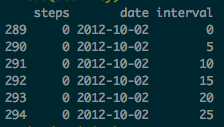
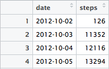

## Loading and preprocessing the data

Data are download from this website [Activity monitoring data](https://d396qusza40orc.cloudfront.net/repdata%2Fdata%2Factivity.zip), store on my folder (don't
forget to change your working directory on RStudio) as the name of **"Activity.csv"** .

First of all I add my R package that I use to during my assignment.  
```{r}
library(dplyr)
library(ggplot2)
library(RColorBrewer)
```

Time to call your data on RStudio and clean it by removing the missing values :

```{r}
activity <- read.csv("activity.csv", na.strings = "NA")
total_NA <- sum(is.na(activity)) # Already store my sum of Missing Value for forward
activity <- na.omit(activity) # Remove Missing values from my dataset  
```

Do a quick look of my dataset : 

```{r}
head(activity)
```
 
## What is mean total number of steps taken per day?  

For this part of the assignment, you can ignore the missing values in the dataset.  

####1. Make a histogram of the total number of steps taken each day  

- Arrange your dataset by grouping steps by day and and make a sum over it :  

```{r}
total_steps <- activity %>% group_by(date) %>% summarise(steps = sum(steps))
```

Result :  

  
- Plot the histogram


## What is the average daily activity pattern?


## Imputing missing values


## Are there differences in activity patterns between weekdays and weekends?
