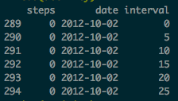
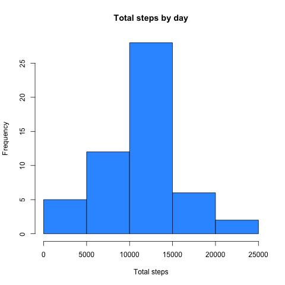
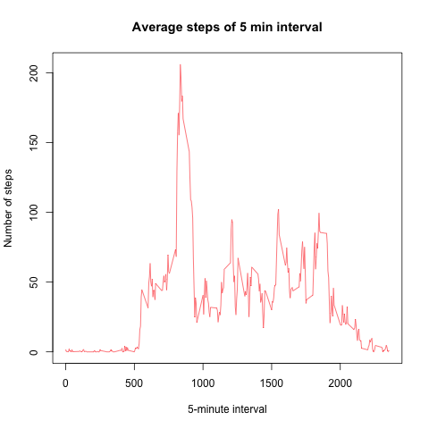
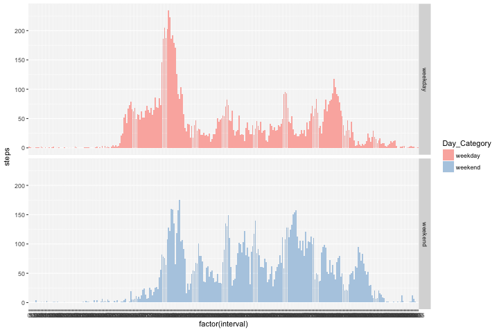

# Reproducible Research: An example


## Loading and preprocessing the data

Data are download from this website [Activity monitoring data](https://d396qusza40orc.cloudfront.net/repdata%2Fdata%2Factivity.zip), store on my folder (don't
forget to change your working directory on RStudio) as the name of **"Activity.csv"** .

First of all I add my R package that I use to during my assignment.  

```r
library(dplyr)
```

```
## 
## Attaching package: 'dplyr'
```

```
## The following objects are masked from 'package:stats':
## 
##     filter, lag
```

```
## The following objects are masked from 'package:base':
## 
##     intersect, setdiff, setequal, union
```

```r
library(ggplot2)
library(RColorBrewer)
```

Time to call your data on RStudio and clean it by removing the missing values :


```r
activity <- read.csv("activity.csv", na.strings = "NA")
total_NA <- sum(is.na(activity)) # Already store my sum of Missing Value for forward
activity <- na.omit(activity) # Remove Missing values from my dataset  
```

Do a quick look of my dataset : 


```r
head(activity)
```

```
##     steps       date interval
## 289     0 2012-10-02        0
## 290     0 2012-10-02        5
## 291     0 2012-10-02       10
## 292     0 2012-10-02       15
## 293     0 2012-10-02       20
## 294     0 2012-10-02       25
```
 
## What is mean total number of steps taken per day?  

####1. Make a histogram of the total number of steps taken each day  

- Arrange your dataset by grouping steps by day  and make a sum over it :  


```r
total_steps <- activity %>% group_by(date) %>% summarise(steps = sum(steps))
```

Result :  

  
- Plot the histogram

```r
hist(total_steps$steps,  col = c("#3399FF"),xlab = "Total steps", main = "Total steps by day")
```

<!-- -->

Result : 



####2. Calculate and report the mean and median of the total number of steps taken per day

```r
mean <-  total_steps %>%  summarise(steps = round(mean(steps),2))
median <-  total_steps %>% summarise(steps = median(steps))
```

The results of the mean and median are *10 766.79 steps* and *10 765 steps*

## What is the average daily activity pattern?

Here below a graph indicating the average number of steps during a 5-minute internal over all the days

```r
mean_5min <-  activity %>% group_by(interval) %>% summarise(steps = round(mean(steps),2))
plot(mean_5min$interval, mean_5min$steps, type="l",xlab = "5-minute interval", ylab = "Number of steps",main = "Average steps of 5 min interval",col = c("#FF6666"))
```

<!-- -->

Result :



By computing the code below, the best number of steps (taken the average of 53 days) is equals to 206 steps at the 835 minutes !!

```r
max_interval <- mean_5min[mean_5min$steps ==  max(mean_5min$steps),]
```

## Imputing missing values

Already done above !!!

## Are there differences in activity patterns between weekdays and weekends?

####1. Create a new factor variable in the dataset with two levels – “weekday” and “weekend” indicating whether a given date is a weekday or weekend day.


```r
activity$date <- as.POSIXlt(activity$date, format = "%Y-%m-%d") # put a format date 
activity$Day_Category <- weekdays(activity$date) # use the weekdays function to display day name
activity$Day_Category <- ifelse(activity$Day_Category %in% c("Samedi", "Dimanche"), "weekend", "weekday")
```

####2. Make a panel plot containing a time series plot of the 5-minute interval and the average number of steps taken, averaged across all weekday days or weekend days

```r
activity2 <- select(activity , -(date)) #Remove date column
wkday <- activity2 %>% group_by(Day_Category,interval) %>% summarise(steps = round(mean(steps),2)) # Arrange dataset for plotting

### MY PLOT ###
ggplot(wkday, aes(factor(interval), steps, fill=Day_Category)) + 
        geom_bar(stat="identity") + 
        facet_grid(Day_Category~.) + 
        scale_fill_brewer(palette="Pastel1")
```

<!-- -->

Result : 


